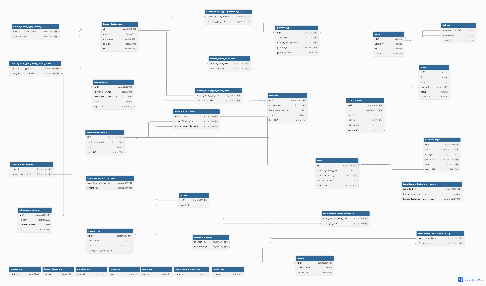

# 🚀 Human-DevOps


This project, **Human-DevOps**, consists of two separate subprojects interacting with each other:

- **Backend**: Implemented in Java (Spring Boot)
- **Frontend**: Implemented in React

## 📋 Prerequisites

- Java 17
- MySQL 8
- Docker >= 20.10
- Docker Compose >=2.5
- API Slack
- React 18.2.0
- SSL Certificate (**HTTPS** required)

> ⚠️ **Important:** Make sure the backend runs with a valid and fully trusted SSL certificate.  
> Slack integration **requires HTTPS** with a full chain SSL certificate.  
> If not, Slack integration **will not work**.


### 🖥️ Supported host operating systems
- **Linux**
- **macOS**
- **Windows**

> ℹ️ **Note for Windows users:** Docker Desktop requires WSL 2.


## 📂 Project Structure

```
Human-DevOps/
├── backend/	# Back-end Java (Spring Boot)
└── frontend/	# Front-end React
```

## 🚀 Installation and Configuration

### 🎥 Installation & Demo Video

Watch a single video covering installation, configuration, and a demo of the application:

> **ℹ️ Note:** This video shows the full end-to-end installation process and a demonstration of the tool. Some URLs or interfaces may have changed slightly since recording.

> **🔒 Security disclaimer:** The SSL certificate (`fullchain.pem`) and private key (`privatekey.pem`) files included in the repository are empty placeholders, provided only as a reference for the correct file structure.
These files do not contain any data and must be replaced with valid certificates and private keys for your domain during deployment.
Similarly, no real credentials (e.g., tokens, secrets, passwords) are included in the repository. All sensitive values must be set manually in your .env file, using .env.template as a starting point.

[](https://youtu.be/RTDYeBveagw)


### 🧾 1. Clone the repository
First, clone the repository:

```bash
git clone https://github.com/investigaciongiis/human-devops.git
cd human-devops
```

### 🔐 2. Prepare SSL Certificates

To enable HTTPS and ensure Slack integration works correctly, you must provide valid SSL files with the following requirements:

nginx/ssl/fullchain.pem – This file must include the full certificate chain (leaf + intermediate + root certificates).

nginx/ssl/privatekey.pem – This file must contain the private key corresponding to the certificate.

⚠️ Important: If these files are invalid, incomplete, or missing, the application will fail to start correctly, and Slack OAuth will not function.

Make sure both files are placed in the appropriate directory:

```
nginx/
└── ssl/
    ├── fullchain.pem        # Full certificate chain
    └── privatekey.pem      # Private key
```

👉 Initially, these files are empty placeholders.
You must replace them with valid SSL certificates issued for your domain to enable secure communication and complete Slack verification successfully.

### 💬 3. Slack Integration

Slack is a workplace communication platform that organizes team conversations into channels. Its rich API lets developers build bots, slash commands and custom workflows that post messages, react to events and integrate with third-party services. This flexibility makes Slack a powerful hub for automating processes, delivering notifications and streamlining information flow in collaborative environments.

To integrate with Slack, we **recommend importing the preconfigured manifest**:

> ✅ **Recommended Option**: Import `slack_manifest.json`

1. Go to [https://api.slack.com/apps](https://api.slack.com/apps)
2. Log in to Slack
3. Select/create your workspace
4. Click **"Create New App"** → **"From an app manifest"**
5. Choose **"JSON"** and paste the contents of:

```bash

resources/slack_manifest.json

```

Customize the values (e.g., URLs or app name) as needed

This will automatically configure:

- **Slash command**: `/questions`  
  → `<URL backend>/slack/events`
- **OAuth Redirect URI**:  
  → `<URL backend>/slack/oauth_redirect`
- **Bot Scopes**:  
  `chat:write`, `commands`, `incoming-webhook`, `app_mentions:read`, `channels:read`
- **User Scopes**:  
  `users:read`, `users:read.email`
- **Bot Events**:  
  `app_home_opened`

> ℹ️ **Note:** If you prefer to configure it manually, you can use the values shown in the `slack_manifest.json` file as reference.


### 🔧 4. Server Configuration

To configure environment variables, use the provided .env.template file as a starting point.

✅ Steps:

1. Copy the template file to create your own .env file:

```bash

cp .env.template .env

```

2. Open the new .env file and edit the values to match your environment.

```properties

# ───── General ─────
# Public domain name (e.g. humandevops.online)
DNS_DOMAIN=<DNS_DOMAIN>

# HTTP PROTOCOL (e.g. https)
HTTP_PROTOCOL=<HTTP_PROTOCOL>

# ───── Ports ─────
# External HTTP port (used by NGINX)
APP_PORT=80  

# External HTTPS port (used by NGINX)
SECURE_APP_PORT=443

# Internal port exposed by the backend service
SERVER_PORT_API=8080


# ───── JWT Security ─────
# Secret key for signing JWT tokens (min 48 characters) (e.g. DMes56OgD3o12445adsf434mes56OGmes56Og345adsf46y4)
JWT_SECRET=<JWT_SECRET>

# JWT expiration in milliseconds (7200000 = 2 hours)
JWT_EXPIRATION_MS=7200000


# ───── Slack Integration ─────
# Slack App client ID (e.g. 1443505669971.9147110231784)
SLACK_CLIENT_ID=<SLACK_CLIENT_ID>

# Slack App client secret (e.g. f93d1ca7b2e64c3f9ad8e503a7c2e8b1)
SLACK_CLIENT_SECRET=<SLACK_CLIENT_SECRET>

# Slack signing secret (e.g. b7f4e19a62c83dd5fa3b7ae29d54c0e1)
SLACK_SIGNING_SECRET=<SLACK_SIGNING_SECRET>


# ───── MySQL Database ─────
# MySQL default port
MYSQL_PORT=3306

# Name of the database to use (e.g. my_database)
MYSQL_DATABASE=<MYSQL_DATABASE>

# MySQL user name (e.g. my_user)
MYSQL_USER=<MYSQL_USER>

# MySQL user password (e.g. my_password)
MYSQL_PASSWORD=<MYSQL_PASSWORD>

# MySQL root user password (e.g. my_root_password)
MYSQL_ROOT_PASSWORD=<MYSQL_ROOT_PASSWORD>


```

* 📝 Note 1: Replace <DNS_DOMAIN> with your actual domain (e.g., mydomain.com). This is required for HTTPS redirection and Slack OAuth integration.
* 📝 Note 2: It is recommended that JWT_SECRET be a secure, random string of at least 48 characters.
* 📝 Note 3: Slack values (SLACK_CLIENT_ID, SLACK_SIGNING_SECRET, SLACK_CLIENT_SECRET) are provided when you create your Slack App.
* 📝 Note 4: Set the values for MYSQL_DATABASE, MYSQL_USER, MYSQL_PASSWORD, and MYSQL_ROOT_PASSWORD according to your own database configuration. If you're using Docker and initializing a new database container, these values will be used to create the database and user during the first startup.


### 🛠 5. Build and Start all services

> ℹ️ **Note:** Make sure you have Docker (>= 20.10) and Docker Compose (>= 2.5) installed on your machine before running the following command.

Build and launch all services using Docker Compose **from the repository root**:

```bash

docker compose up --build -d

```
### 6. First Steps and Testing

Once all services are up and running:

- **Access the application web UI**  
  Open your frontend URL in a browser (e.g., `https://<YOUR_DOMAIN>/`).

- **Create a Team Manager account**  
  Register as a new user and select the “Team Manager” role.

- **Log in with the Team Manager account**  
  Sign in using the credentials you just created.

- **Initiate Slack installation**  
  From the application, in team click on “Add to Slack” and complete the installation.

- **Return to Slack and reinstall the app**  
  Go back to your Slack workspace and reload the page.  
  If prompted with a yellow banner saying scopes have changed, click **“Reinstall to Workspace”**.  
  In the permissions screen that appears, make sure to **select the app itself as the posting channel** (e.g., `#HumanDevOps`), then click **Allow** to complete the installation.

- **Go to app channel and run `/questions`**  
  In Slack, type the slash command to launch the questionnaire.

- **Verify integration in the app**  
  Return to the web UI, go to the **Team** screen, and verify you see “Slack integration has been completed.”

- **Add team members**  
  First invite them with Slack, then with "Add selection" in home.

- **Schedule questionnaire delivery time**  
  Set in the app what time the questionnaire should be sent automatically each day, Monday through Friday.

> ✔️ With these steps, your Human DevOps environment is ready for full testing and use.


## 📦 Additional Information

### 🗃️ Database Information (MySQL 8)

The application uses MySQL 8, configured via Docker. On the first run:

* A database called my_database is created.

* User my_user with password my_password is granted access.

* Spring Boot connects and automatically creates the required tables using JPA.

* Initial data is optionally inserted via a Java seeder or data.sql.

* All data is persisted using Docker volumes.

Below is the database schema diagram:



### 🧩 Dependency relationships

The file backend/src/main/resources/data.sql encodes the list of dependency relationships among factors, thereby facilitating both the integration of updates and the potential adaptation of the tool to entirely new conceptual models. It includes SQL statements that enable the population of the database with predefined human factors and their corresponding relationships. The initial section of the file specifies clusters of human factors, followed by the systematic specification of the dependency relationships between individual human factors. For the implementation of a novel conceptual model, it is sufficient to substitute the .sql file prior to installation.


### 🔁 Resetting the Docker environment (SSL or other config errors)

When to use this: If you started the stack with the wrong SSL files, an incorrect .env, or any other mis-configuration, it’s usually faster to wipe everything and start fresh.

⚠ **Warning:** This command stops every container and removes all Docker volumes, deleting all data (database, uploads, etc.).

Run it **from the project root** (where docker-compose.yml is located):

```bash

docker compose down -v

```

### 🔐 Security Model

This project follows a **DevSecOps** approach, integrating security checks from development through production.

- **Secrets management:** *No tokens committed to VCS.* All credentials are injected at runtime via environment variables defined in `.env` **template** (kept in the repo).
- **Transport security:** The NGINX reverse-proxy forces HTTPS (port 80→443) with a full-chain certificate. TLS is required by Slack’s signature validation.
- **AuthN/AuthZ:** REST API secured with **Spring Security + JWT** (2 h exp). Secret length ≥ 48 chars (see `application.properties`).
- **Slack scopes (least privilege):** `chat:write`, `commands`, `incoming-webhook`, `app_mentions:read`, `channels:read`, `users:read(.email)`—declared in `slack_manifest.json`.
- **Container isolation:** All services run in a private Docker network (`human-net`). Only NGINX exposes ports externally; DB volumes are mounted on dedicated Docker volumes.
- **TLS certificates:** The repo ships **empty placeholders** (`fullchain.pem`, `privkey.pem`).  
  You must provide valid CA-signed certificates (or self-signed ones for local testing only).


### 🧩 Optional: Enable phpMyAdmin (localhost only)

By default, the environment only runs the **MySQL** database service.  
If you want a local web UI to inspect the DB, an optional phpMyAdmin override is provided at:

- `resources/docker-compose.phpmyadmin.yml`

**Start with phpMyAdmin enabled (local only):**

```bash

docker compose -f docker-compose.yml -f resources/docker-compose.phpmyadmin.yml up --build -d

```

Once running, phpMyAdmin will be available at:

http://localhost:8081


## 🎥 Demo Video

Watch a single video a demo of the application:

> **ℹ️ Note:** This video shows the full end-to-end installation process and a demonstration of the tool. Some URLs or interfaces may have changed slightly since recording.


[](https://youtu.be/wZlg-_gojrQ)

## 🎬 Live Demo

🔗 [Example Deployed Application](https://giis.inf.um.es/humanDevOps/)


### 📊 Demo Data and Export Examples

A dedicated directory has been added at:

```
Human-DevOps/
└── resources/
    └── demo/
```

This folder includes:
- **`data_demo.sql`** → a complete SQL dataset that populates the database with sample human factors, their relationships, and recommendations.  
- **Export examples** → example files of **Human Factors** and **Recommendations** available in all supported formats:
  - `human-factors_demo.xlsx`
  - `human-factors_demo.csv`
  - `human-factors_demo.json`
  - `recommendations_demo.xlsx`
  - `recommendations_demo.csv`
  - `recommendations_demo.json`

These examples allow users to:
- Experiment with the system without requiring live Slack integration.
- Inspect the structure and content of exported files.
- Reproduce and analyze how recommendations evolve over time.

> 💡 **Tip:** To load the demo dataset, import `data_demo.sql` into your MySQL instance before starting the backend container:

```bash

docker exec -i mysql mysql -u<user> -p<password> <database> < resources/demo/data_demo.sql

```


## 📘 API Documentation

You can explore the full API via Swagger:

[](https://editor.swagger.io/?url=https://raw.githubusercontent.com/investigaciongiis/human-devops/main/resources/swagger.yaml)

- [Swagger (YAML)](https://github.com/investigaciongiis/human-devops/blob/main/resources/swagger.yaml)  
- [Raw YAML file (for manual copy)](https://raw.githubusercontent.com/investigaciongiis/human-devops/main/resources/swagger.yaml)

> ⚠️ **Note:** In some browsers, the spec might not load directly in Swagger Editor due to CORS restrictions. If that happens, open the [raw YAML file](https://raw.githubusercontent.com/investigaciongiis/human-devops/main/resources/swagger.yaml), copy its contents, and paste it manually into [Swagger Editor](https://editor.swagger.io).


## 🧪 Postman Collection

You can test the API using Postman with the following files available in the repository:

- 📁 [Postman Collection (JSON)](https://github.com/investigaciongiis/human-devops/blob/main/resources/postman_collection.json)  
- 🌐 [Postman Environment (JSON)](https://github.com/investigaciongiis/human-devops/blob/main/resources/postman_environment.json)

> ✅ **Recommended:** Import both files into Postman to test the endpoints using environment variables.

## 🚀 Usage

After backend and frontend services are running and Slack integration is complete, access the application via the frontend URL.

Once integrated, the Team Manager has access to:

- **Graph Analysis**: View graphical representations of team responses.
- **Team Management**: Add or remove team members and launch questionnaires.
- **Recommendations**: Access recommendations based on team input.


## 🤝 How to contribute

Thank you for your interest in contributing to this project!

To contribute, follow these steps:

1. Fork the repository.
2. Create a new branch: `git checkout -b my-feature`
3. Make your changes and commit: `git commit -m 'Add new feature'`
4. Push to your fork: `git push origin my-feature`
5. Open a Pull Request

Please make sure your code follows the project's style and structure.

If you have questions or suggestions, feel free to open an issue.


## 🐞 Issue reporting

To facilitate effective issue management, a descriptive title, detailed steps to reproduce the problem, a comparison between expected and actual behavior, and relevant information about the operating environment should be provided.


## ❓ Support

For any questions or issues, please open an issue in this GitHub repository.

## 📬 Contact

If you have questions or prefer to reach out by email, you can write to:  
**investigaciongiis@gmail.com**

## 📜 License

MIT

---

**🏛️ Software Engineering Research Group of the University of Murcia, Spain 🇪🇸**

